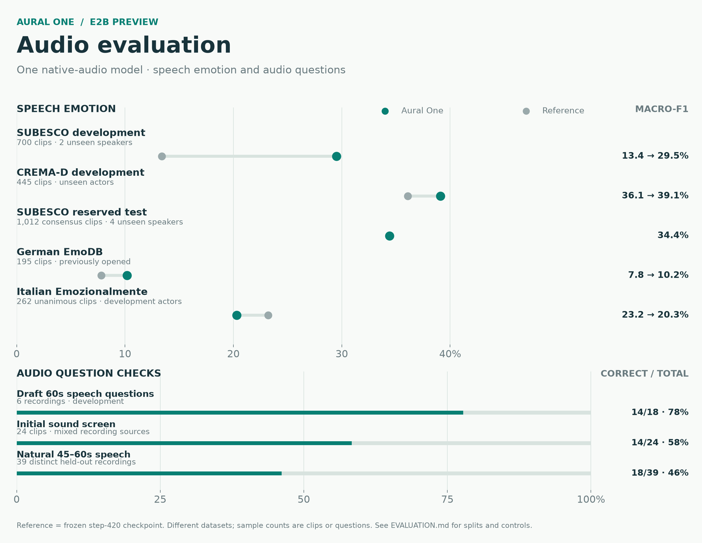

# Aural One

**Native audio in, structured decisions out.** Aural One is an early Gemma 4 E2B preview for questions that depend on what a recording actually sounds like. Supply audio, a written state, and named questions; the model scores the options for each question in a single native-audio model. It does not require a speech-to-text or external sound classifier in its inference path.

[Model weights and card](https://huggingface.co/blazeofchi/Aural-One-E2B) · [Evaluation details](docs/EVALUATION.md) · [Fine-tuning guide](docs/FINE_TUNING.md) · [Training and data](docs/TRAINING.md) · [Release validation](docs/RELEASE_VALIDATION.md)

## What the preview does

- Scores **2–8 supplied options** for each of up to **32 named questions**. Binary No/Yes and ordinal decisions use the same interface.
- Accepts written state alongside the audio, so the same recording can answer different questions.
- Uses Gemma 4 E2B's native audio tower plus a frozen adapter and **54.3 million trained acoustic/projection weights**. The language model stayed frozen during the final training stage.
- Handles recordings up to **60 seconds** in the tested path. The included simple loader runs each question separately; the timing study used a shared-audio serving path.

## Selected results

| Test | Aural One preview |
|---|---:|
| CREMA-D actor-held-out development, macro-F1 | **0.391** on 445 clips |
| SUBESCO speaker-held-out development, macro-F1 | **0.295** on 700 clips, up from 0.134 for the frozen reference |
| SUBESCO four-speaker reserved test, macro-F1 | **0.344** on 1,012 consensus clips |
| Typed choice / No-Null / ordinal development | **189 / 174 / 191 correct** out of 200 each |
| Warm pod-local HTTP, ~58-second Opus with three questions | **0.508 s p50 / 0.579 s p95** |

These are different datasets and scopes, not one combined benchmark score. [The complete evaluation table](docs/EVALUATION.md) includes other languages, longer natural speech, sound events, calibration, client latency, throughput, and cost. This is an **early research release**; performance is uneven across sounds and emotions, and the sub-second result above is inside the pod rather than Tokyo-to-server latency.



## Run it

Use Python 3.12 and an NVIDIA GPU. The tested environment used PyTorch 2.13.0 with CUDA 13.0, Transformers 5.17.0, and PEFT 0.21.0. Install a PyTorch build appropriate for your GPU first, then:

```bash
pip install -e .
python scripts/predict.py examples/request.json
```

Edit `examples/request.json` to point `audio` to an absolute path to your own WAV or FLAC file. The first run downloads the [pinned Gemma 4 E2B base](https://huggingface.co/google/gemma-4-E2B-it) and the [Aural One delta](https://huggingface.co/blazeofchi/Aural-One-E2B). The base model is not duplicated in this release. The release loader passed smoke checks on a **24 GB Blackwell GPU partition**; its observed PyTorch allocation was 9.8 GiB. A lower minimum VRAM has not been established.

The returned `probabilities` are normalized **over the options supplied in that question**. They are not calibrated confidence or a free-form numeric regression output. For a binary answer, give options such as `["No", "Yes"]`; for an ordinal value, give the score labels as options.

## Repository layout

```text
src/aural_one/       pinned loader, choice scoring and acoustic optimizer
scripts/predict.py   JSON command-line example
scripts/train_full_audio.py, build_schedule.py, evaluate.py   training and evaluation
examples/            request shape
docs/EVALUATION.md   measurements and their scopes
docs/FINE_TUNING.md  data schema and reproducible recipe
docs/TRAINING.md     training recipe, data and attribution
release.json         checkpoint identity and hashes
```

The model weights are on Hugging Face. No training or evaluation audio is redistributed.

## License

Code and Aural One weight deltas: Apache 2.0. The Gemma 4 E2B base is Apache 2.0 and downloaded separately. Training datasets retain their own licenses; see [data attribution](docs/TRAINING.md).
